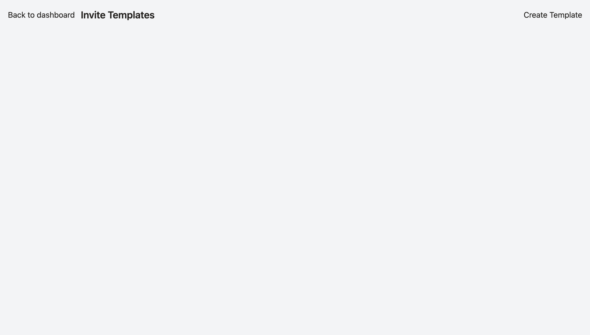
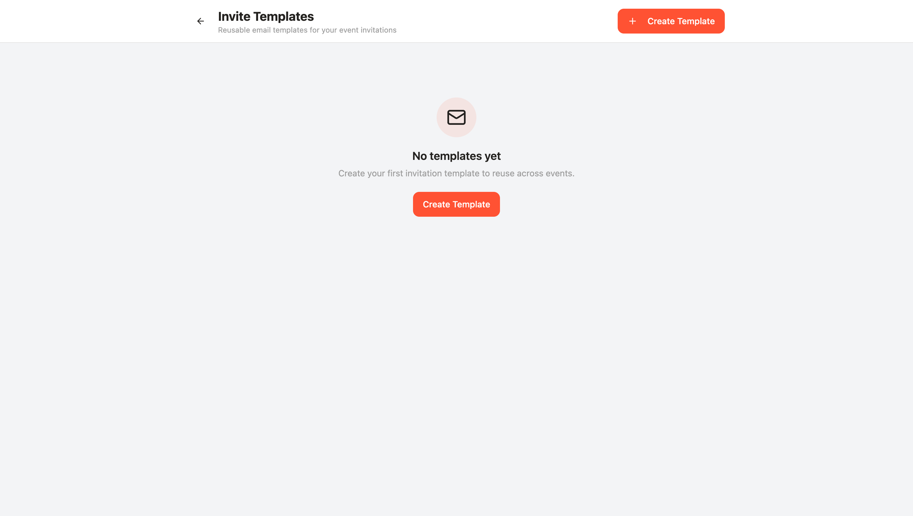
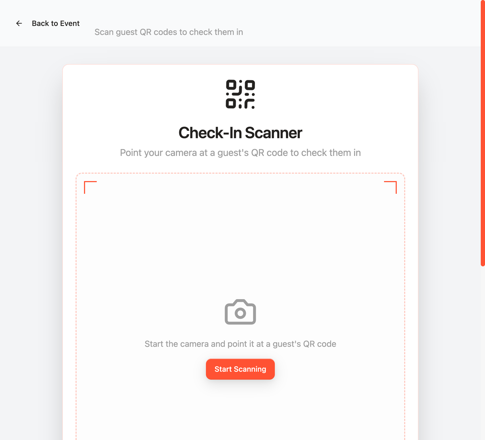
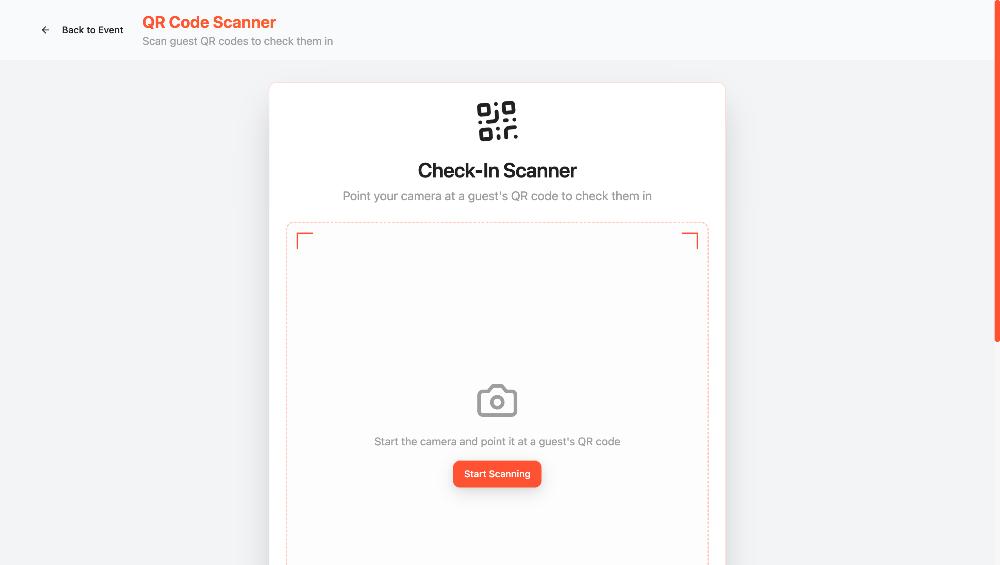

# UI Structure Audit & Refactor — Web App (August 2026)

**Scope:** the web app (`src/`), all pages reachable via router routes and the `currentPage` state machine.
**Method:** full static audit of the component tree + live page-by-page inspection in Chrome (via the WebMCP monitoring tools, see `docs/WEBMCP_MONITORING.md`).
**Outcome:** landed as PR [#6](https://github.com/QuantmindSSI/Partyhause/pull/6) (PageShell consolidation) with follow-up wiring in PR [#8](https://github.com/QuantmindSSI/Partyhause/pull/8).

This supersedes the October 2025 `UI_UX_AUDIT_SUMMARY.md`, which covered the mobile app.

---

## 1. What the audit found

The app was mid-migration between **three design generations**:

1. **Dead "cosmic/soft" generation** — 4 unused landing page variants, the old `Dashboard.tsx`, and 8 other page-level components with zero importers (~3,900 lines total).
2. **"Liquid Metal" custom-CSS generation** — `EventCreation`, `EventManagement`, `GuestView`, `QRScanner`, driven by ~40 bespoke component classes in `src/index.css` (1,900 lines).
3. **shadcn-token generation** — `src/pages/*`, the cleanest and the migration target.

### Structural problems

- **No shared layout existed.** Every page rebuilt its own sticky header, container and background, with drift: `bg-card` vs `bg-white`, `max-w-2xl`→`max-w-7xl` with no rule, 4 divergent header scaffolds, the bell/settings/avatar cluster copy-pasted 3×, hand-rolled empty states 4× despite `ui/empty-state.tsx` existing.
- **Broken-by-construction styling:**
  - `tailwind.config.ts` referenced `--gradient-primary/hero/card` CSS variables that were **defined nowhere** → every `bg-gradient-primary bg-clip-text text-transparent` heading rendered **invisible** (QR Scanner title, GuestView "You're Invited!").
  - `animate-neon-flicker` used with no such keyframes defined.
  - `TemplateManager` used DaisyUI-style `btn`/`input`/`textarea` classes that don't exist in this project — **the entire page rendered unstyled**.
  - Dark-theme `input-shimmer` inputs on light pages (white-on-white text risk); `text-white` headings on light glass panels (invisible).
- **Navigation dead ends:** tiles/cards navigating to `currentPage` values that render the same screen again (`my-tickets`, `saved-events`, `analytics`, all six `vendor-*` actions); Settings items linking to Settings itself; `navigate()` calls to router paths that have no `<Route>`.
- **A11y:** clickable `<Card>`/`<Avatar>` elements invisible to keyboard/AT, icon buttons with no accessible name, auth inputs with no `id`/`name`/label (Chromium autofill warning), no mobile menu on the landing page.

### Evidence (before / after)

| Page | Before | After |
|---|---|---|
| Invite Templates (completely unstyled → rebuilt with ui primitives) |  |  |
| QR Scanner (invisible page title → visible gradient heading) |  |  |

---

## 2. What was fixed (landed on main)

### Central
- **`src/components/layout/PageShell.tsx`** — single shared scaffold: sticky `bg-card` header, back button, title/subtitle, `actions` slot, `headerBottom` slot (sticky filter tabs), width presets (`sm`→`2xl`), `bg-background` page. Exports `UserMenu` (accessible bell/settings/avatar cluster) and `useBackToDashboard` (role-aware back, previously duplicated).
- **Adopted by 9 pages:** UserDashboard, CreatorDashboard, VendorDashboard, SettingsPage, ProfilePage, ExplorePage, SocialFeedPage, GamesPage, TemplateManager (~300 duplicated lines deleted).
- **Design tokens:** `--gradient-primary/hero/card` defined in `src/index.css` (fixes the invisible headings); `animate-neon-flicker` usages removed; page background standardized on `bg-background`.
- **Dead code deleted (verified zero importers before deletion):** `Dashboard`, `LandingPage`, `LandingPageSoft`, `LandingPageCosmic`, `EnhancedEventCreation`, `EventQRGenerator`, `EmailStatusDashboard`, `GuestListWithCrew`, `CostSplitManager`, `DebugPanel`, `DebugMonitorPanel`, `InstallPrompt`, `use-monitoring` (~3,900 lines).

### Per page
- **TemplateManager:** rebuilt on `Button/Input/Textarea/Label/Checkbox/Dialog/AlertDialog/EmptyState`; Radix provides the focus trap + Escape handling that was hand-rolled; `window.confirm` replaced with `AlertDialog`; dirty-check preserved.
- **AuthScreen:** `id`/`name`/`aria-label`/`autoComplete` on all three inputs; named password toggle.
- **SettingsPage:** items are real `<button>`s; "Notifications"/"Privacy" self-links became honest "Coming soon" rows (later implemented for real in PR #8).
- **ProfilePage:** fixed "Join Crew" showing on your own profile (`isOwnProfile` relied on the stubbed Supabase session; now checks the store); removed dev-artifact copy ("create it in Supabase", "once implemented"); semantic tokens throughout.
- **CreatorDashboard:** fake "Analytics" stat link (navigated to itself) neutralized to an honest "Soon" stat.
- **EventManagement / EventCreation / QRScanner / GuestView:** `input-shimmer` → `input-liquid` on light pages; 4× `text-white` headings on light glass → `text-foreground`.
- **PartyCultureBlog:** labeled search + newsletter inputs; fixed `w-80` overflow on small viewports.
- **7× `bg-orange-500 hover:bg-orange-600 text-white`** button bypasses → default `<Button>` (identical rendering via `--primary`).

**Verification:** typecheck clean on all touched files, production build passes, every refactored page re-inspected live, 0 runtime errors captured by the monitoring layer during the walkthrough.

---

## 3. Deferred work (known, intentional)

Ordered by value; none are regressions — all pre-date the refactor.

1. **Hybrid router unification.** 6 real routes + a persisted `currentPage` state machine; URL and UI state routinely disagree; several `navigate()` targets have no matching route (`/auth`, `/events/:id`, poll deep links). Unify on react-router after PageShell (done) — touches the store persistence, `src/mcp/tools.ts` `NAVIGABLE_PAGES`, and every nav call site.
2. **`EventCreation.tsx` split (≈1,100 lines).** 7-step wizard + invite flow + template flow with tangled state. Extract steps only with characterization tests first.
3. **Template forms consolidation.** 12 near-identical forms (~5,400 lines) → config-driven renderer; the unused `ui/form.tsx` (react-hook-form) is the natural base.
4. **"Liquid Metal" CSS retirement.** Migrate the remaining generation-2 pages to shadcn variants page-by-page, then delete the bespoke classes and the duplicate keyframes in `src/index.css` (several `@keyframes` are defined twice with different bodies).
5. **Dark mode.** `darkMode: ["class"]` is configured but no `.dark` token block exists — currently impossible to enable.
6. **Dashboard no-op destinations.** `my-tickets`, `saved-events`, `vendor-*` still render the parent dashboard; either implement or remove the tiles.
7. **Pre-existing type errors** (~18) in `GameRecommendationService`, `use-auth`, `msal-config`, and tests — untouched by this work.
